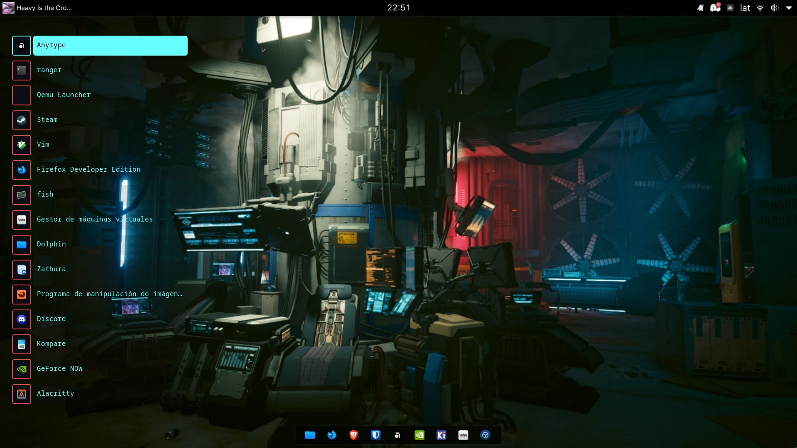
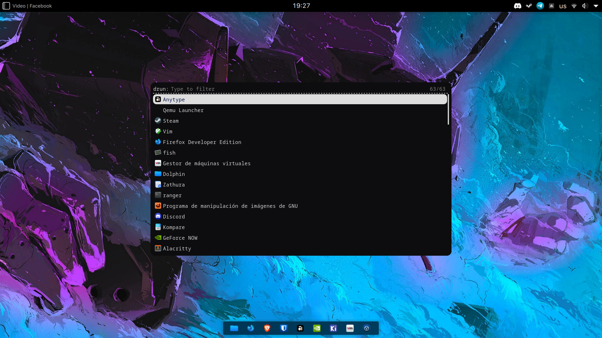
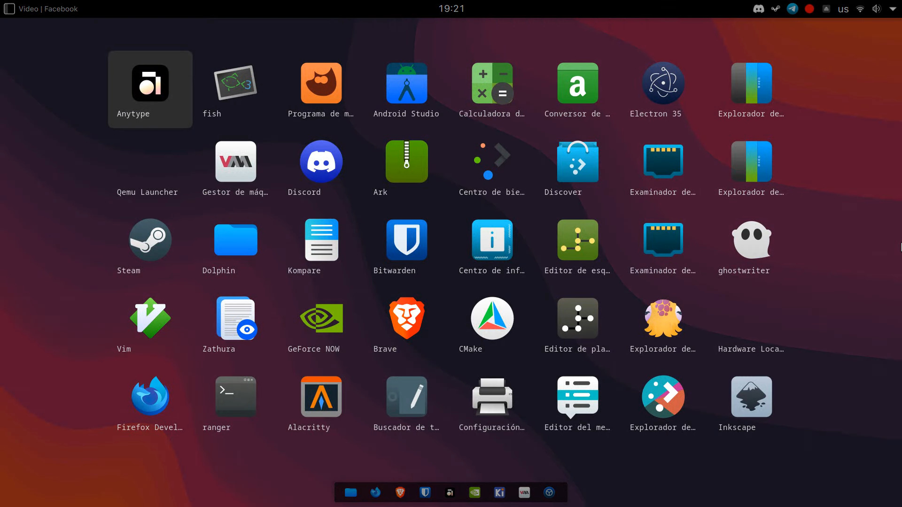
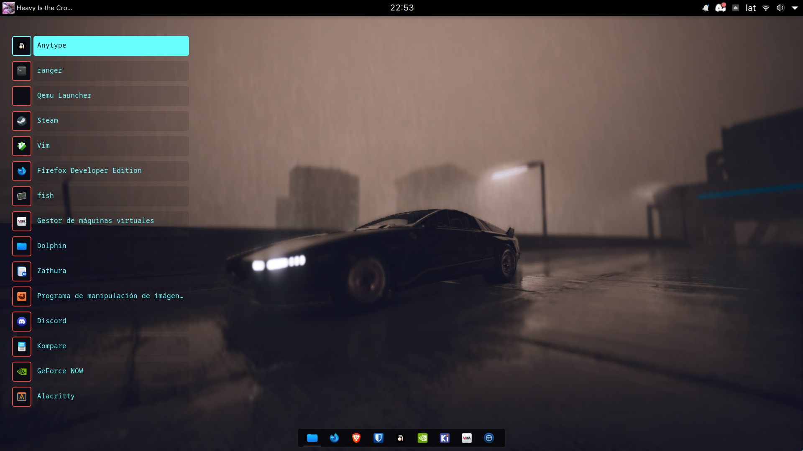

# Rofi dotfiles

Configuración, Scripts & Temas de rofi basados en Gnome y Cyberpunk 2077

## Paquete de iconos
- [Kora](https://store.kde.org/p/1256209)

### Temas
|Tema |Comando|Captura|
|:---:|:------|:-----:|
|Dark       |`rofi -show drun -theme dark`  |
|Gnome      |`rofi -show drun -theme gnome` |
|Cyberpunk  |`rofi -show drun -theme cyberpunk`|

## Scripts
|Tema|Comando|Información|
|----|-------|-----------|
|base|`$SHELL .config/rofi/scripts/powermenu.sh`|Menu de apagado|
|browser|`$SHELL .config/rofi/scripts/browser.sh`|Shortcuts de navegador (Brave)|
